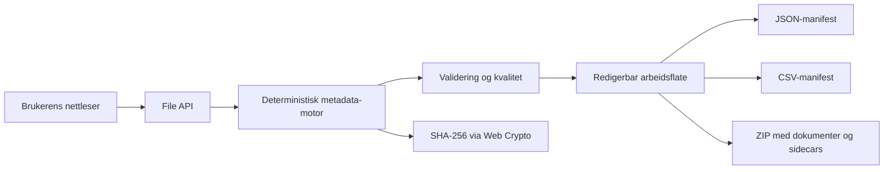

# Arkitektur

## Oversikt

Ingen filinnhold sendes ut av nettleseren.

## Moduler

- `index.html`: semantisk appskall og skjemaer.
- `styles.css`: responsivt grensesnitt uten eksterne ressurser.
- `engine.mjs`: forslag, datakvalitet, filnavn, manifest og personopplysningssignaler.
- `zip.mjs`: liten, avhengighetsfri ZIP-skriver med CRC-32 og UTF-8-filnavn.
- `app.mjs`: File API, Web Crypto, tilstand, redigering og nedlasting.
- `tests/`: Node-tester av den deterministiske logikken.

## Tillitsgrenser

- Filene eksisterer bare i brukerens nettleserøkt.
- Sidecar-metadata er et overføringsformat, ikke et uforanderlig arkivformat.
- Mønstergjenkjenning av personopplysninger er indikatorer, ikke klassifisering.
- Tilgang og bevaring må vedtas etter virksomhetens regler og hjemler.

## Produksjonsløp

En virksomhetstilpasset versjon kunne lagt motoren bak et API og koblet den til identitet, metadatakatalog, klassifikasjonssystem, sak-/arkivsystem og en hendelseslogg. Klientens statiske modus kan beholdes som trygg forhåndsvisning.
