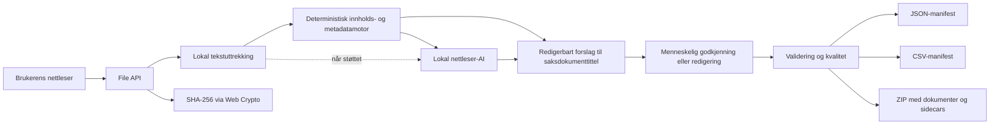

# Arkitektur

## Oversikt

Ingen dokumenter sendes til en Archive Assist-server. Den generative funksjonen bruker bare en lokal språkmodell når nettleseren tilbyr dette.

## Tittelflyt

1. `extract.mjs` henter lesbar tekst fra støttede formater.
2. `engine.mjs` finner dokumenttype og eksplisitte metadata, og bygger et første saksdokumenttittelforslag fra emne, tittel, overskrift eller første meningsbærende setning.
3. Filnavnet brukes bare når innholdet ikke gir et forsvarlig forslag.
4. `ai.mjs` kan forbedre forslaget med den versjonerte prompten i `TITTELPROMPT.md`.
5. `app.mjs` hindrer AI i å overskrive en tittel som allerede er godkjent eller redigert av et menneske.
6. Metode, begrunnelse, sikkerhet, promptversjon og kontrollstatus følger eksporten.

## Moduler

- `index.html`: semantisk appskall, tittelforslag og redigerbare metadatafelt.
- `styles.css`: responsivt grensesnitt uten eksterne ressurser.
- `extract.mjs`: lokal tekstlesing for tekst, e-post, PDF, Office Open XML og OpenDocument.
- `engine.mjs`: innholdsbaserte forslag, datakvalitet, filnavn, manifest og personopplysningssignaler.
- `ai.mjs`: lokal Prompt API-integrasjon, strukturert svarskjema og prompt-injeksjonsvern.
- `zip.mjs`: avhengighetsfri ZIP-skriver med CRC-32 og UTF-8-filnavn.
- `app.mjs`: File API, Web Crypto, tilstand, menneskelig kontroll, lokal AI og nedlasting.
- `tests/`: Node-tester av tittelregler, prompt, uttrekk, metadata og ZIP.

## Tillitsgrenser

- Filene eksisterer bare i brukerens nettleserøkt.
- Dokumenttekst er ubetrodd data og avgrenses tydelig i AI-prompten.
- Et tittelforslag er ikke journalføring eller et arkivfaglig vedtak.
- Sidecar-metadata er et overføringsformat, ikke et uforanderlig arkivformat.
- PDF-uttrekk er grunnleggende og erstatter ikke OCR.
- Mønstergjenkjenning av personopplysninger er indikatorer, ikke klassifisering.
- Tilgang og bevaring må vedtas etter virksomhetens regler og hjemler.

## Produksjonsløp

En virksomhetstilpasset versjon kunne koblet løsningen til identitet, klassifikasjonssystem, metadatakatalog, sak-/arkivsystem, godkjent modellplattform og en uforanderlig hendelseslogg. Den lokale klientmodusen kan beholdes som trygg forhåndsvisning og kontrollflate.
