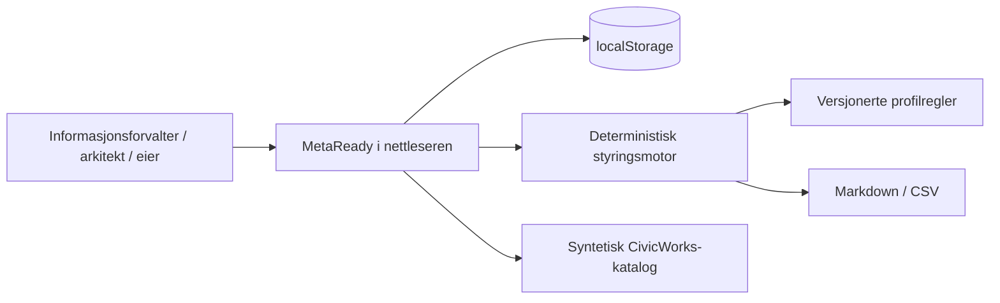
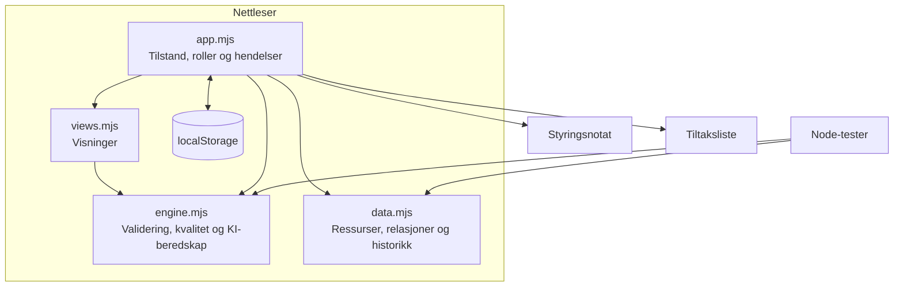

# Arkitektur

## Kort om valget

MetaReady er publisert som en statisk og deterministisk nettleserapp. Det gjør demoen enkel å åpne uten innlogging, betalte tjenester eller en backend som må være i drift.

Reglene ligger adskilt fra visningen, slik at de senere kan flyttes bak et API uten å skrive om hele løsningen.

## Kontekst

## Komponenter

## Ansvarsområder

| Område | Ansvar |
|---|---|
| Katalog | Finne ressurser, eierskap, status og beskrivelser |
| Profilvalidering | Kontrollere regler og vise bevis og foreslåtte tiltak |
| Kvalitet | Vise flere separate kvalitetsdimensjoner i stedet for ett uklart tall |
| KI-beredskap | Vurdere om en ressurs er egnet til et bestemt brukstilfelle |
| Relasjoner | Direkte koblinger, bevis, sikkerhet og mulig konsekvens |
| Arbeidsflyt | Utkast, vurdering, godkjenning, publisering og beslutninger |
| Tiltak | Prioritert arbeid med ansvar, effekt, risiko, hast og innsats |
| Historikk | Hendelser som legges til etter hvert |

## Noen viktige valg

### ADR-001 — Statisk først

**Valg:** Demoen kjører uten backend eller tredjepartsavhengigheter.

**Hvorfor:** Den skal være lett å åpne og enkel å holde tilgjengelig.

**Ulempe:** Roller og historikk er demonstrasjoner, ikke produksjonskontroller.

### ADR-002 — Faste regler før generativ KI

**Valg:** Kjernelogikken bruker eksplisitte regler og registrerte bevis.

**Hvorfor:** Et styringsresultat bør kunne forklares og gjentas uten en språkmodell.

**Ulempe:** Appen foreslår ikke beskrivelser eller kartlegginger med KI.

### ADR-003 — Bevis før totalscore

**Valg:** Kvalitet og KI-beredskap beholder separate dimensjoner, bevis, antakelser og tiltak.

**Hvorfor:** Ett pent tall kan skjule et viktig problem.

**Ulempe:** Det blir mer informasjon å lese i grensesnittet.

## Videre utvikling

Kjernelogikken kan flyttes bak et FastAPI-endepunkt med PostgreSQL. Den statiske adapteren kan samtidig beholdes for GitHub Pages og enkle demoer.
