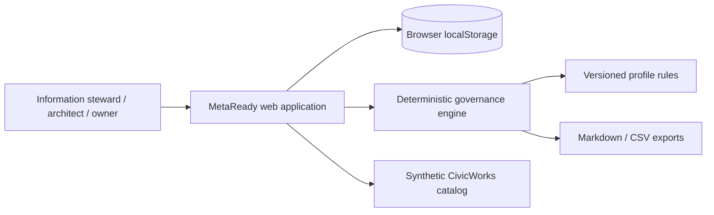
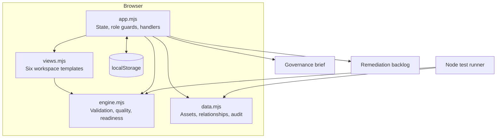

# Architecture

## Decision summary

MetaReady is deployed as a deterministic static application because the public demonstration must remain available without credentials, paid services or a running backend. Domain rules are separated from presentation so they can later be reused behind an API.

## Context

## Containers

## Domain boundaries

| Boundary | Responsibility |
|---|---|
| Catalog | Asset discovery, ownership, status and description |
| Profile validation | Rule evaluation with exact evidence and remediation |
| Quality | Separate, inspectable dimensions rather than one opaque score |
| AI readiness | Suitability for a selected use case, including assumptions and blockers |
| Lineage | Direct relationships, evidence, confidence and impact |
| Workflow | Draft, review, approval, publication and recorded decisions |
| Remediation | Prioritized work with owner, impact, risk reduction, urgency, effort and status |
| Audit | Append-oriented local event history |

## Key choices

### ADR-001 — Static first

**Decision:** Ship a no-dependency static application for the public demo.

**Why:** It maximizes availability, removes credential and hosting dependencies, and allows every user journey to be tested directly in a browser.

**Trade-off:** Role enforcement and audit durability are demonstrations, not production controls.

### ADR-002 — Deterministic rules before generative AI

**Decision:** All core behavior uses stored rules and evidence.

**Why:** Governance conclusions must be inspectable, repeatable and usable without an API key.

**Trade-off:** The application does not draft descriptions or mappings with a language model.

### ADR-003 — Evidence before aggregate score

**Decision:** Quality and AI readiness retain separate dimensions, evidence, confidence, assumptions and actions.

**Why:** A single unexplained score can hide critical blockers.

**Trade-off:** The interface contains more detail, requiring strong scanning and table design.

## Production evolution

The domain engine can move behind a FastAPI endpoint with PostgreSQL persistence. The browser adapter would be replaced by a typed API adapter while preserving the same views and deterministic static adapter for GitHub Pages.
