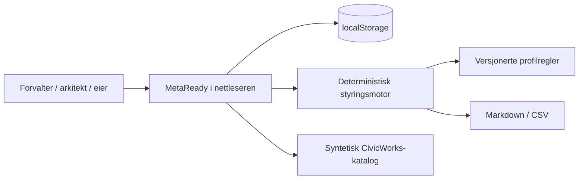
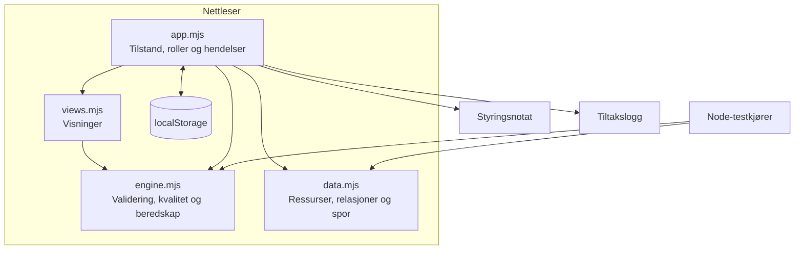

# Arkitektur

## Kort fortalt

MetaReady er laget som en deterministisk, statisk app. Poenget er at demoen skal virke uten innlogging, betalte tjenester eller en server som må holdes i live. Domenereglene ligger for seg, slik at de senere kan flyttes bak et API uten å skrive alt på nytt.

## Kontekst

## Deler

## Ansvarsområder

| Del | Ansvar |
|---|---|
| Katalog | Finne ressurser, eierskap, status og beskrivelser |
| Profilvalidering | Kjøre regler og vise konkret bevis og tiltak |
| Kvalitet | Flere synlige dimensjoner i stedet for ett uklart tall |
| AI-beredskap | Egnethet for et bestemt bruksområde, med antakelser og sperrer |
| Relasjoner | Direkte avhengigheter, bevis, sikkerhet og konsekvens |
| Arbeidsflyt | Utkast, vurdering, godkjenning og publisering |
| Tiltak | Prioritert arbeid med ansvar, effekt, risiko, hast og innsats |
| Revisjonsspor | Lokal, løpende hendelseshistorikk |

## Noen bevisste valg

### ADR-001 — Statisk først

**Valg:** Den åpne demoen er en statisk app uten runtime-avhengigheter.

**Hvorfor:** Den er lett å åpne og enkel å holde i drift. Alle hovedflyter kan prøves direkte i nettleseren.

**Ulempen:** Roller og revisjonsspor er demonstrasjoner, ikke produksjonskontroller.

### ADR-002 — Regler før generativ AI

**Valg:** Kjernelogikken bruker lagrede regler og bevis.

**Hvorfor:** En styringsvurdering bør kunne gjentas og forklares uten at svaret endrer seg fra gang til gang.

**Ulempen:** Appen bruker ikke en språkmodell til å foreslå beskrivelser eller kartlegginger.

### ADR-003 — Bevis før totalscore

**Valg:** Kvalitet og AI-beredskap beholder egne dimensjoner, bevis, antakelser og tiltak.

**Hvorfor:** Et pent gjennomsnitt kan skjule en alvorlig sperre.

**Ulempen:** Grensesnittet får mer detalj enn en enkel trafikklysmodell.

## Hvis dette skulle videre

Domenemotoren kan flyttes bak et FastAPI-endepunkt med PostgreSQL. Nettleserlageret kan da byttes ut med et API, mens visningene og den statiske GitHub Pages-demoen fortsatt kan leve videre.
